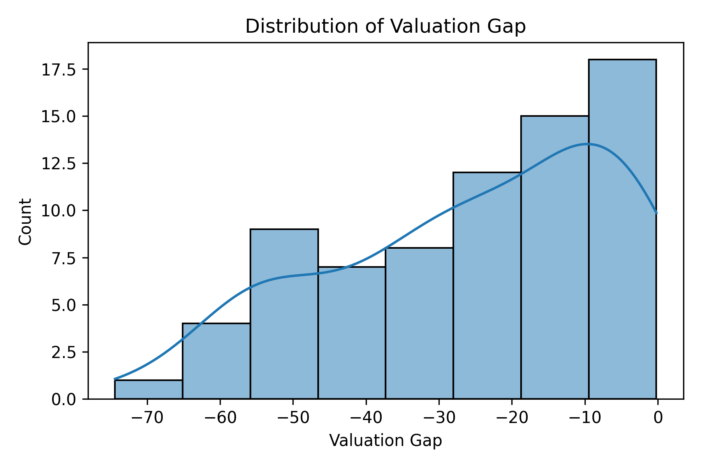
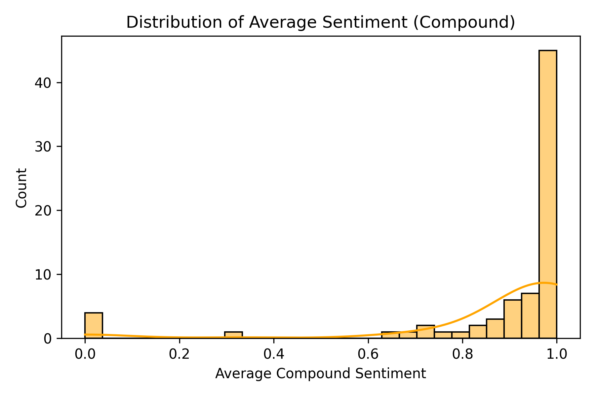
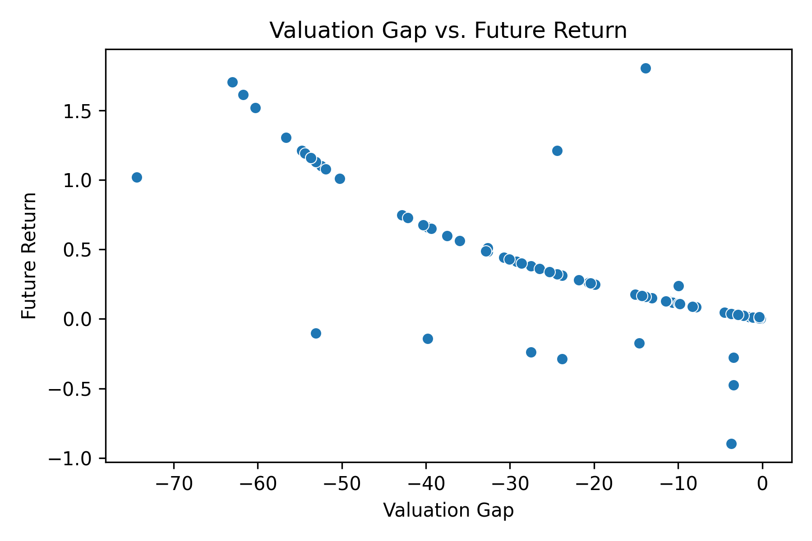
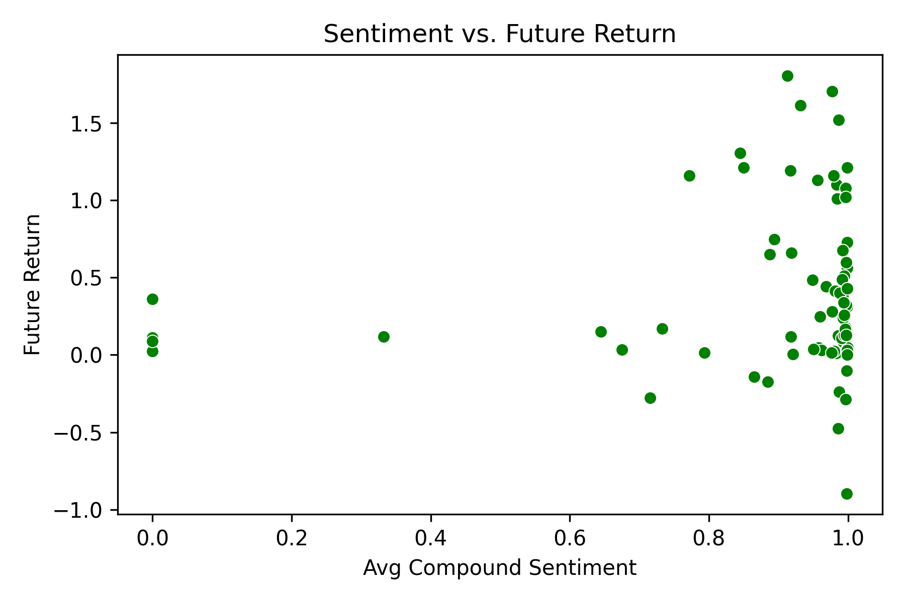
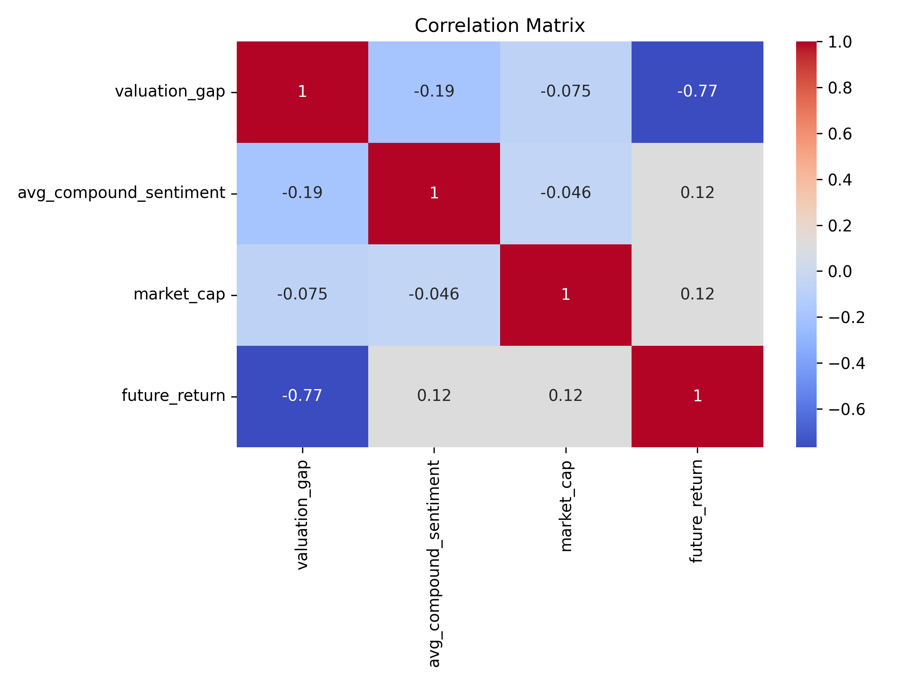
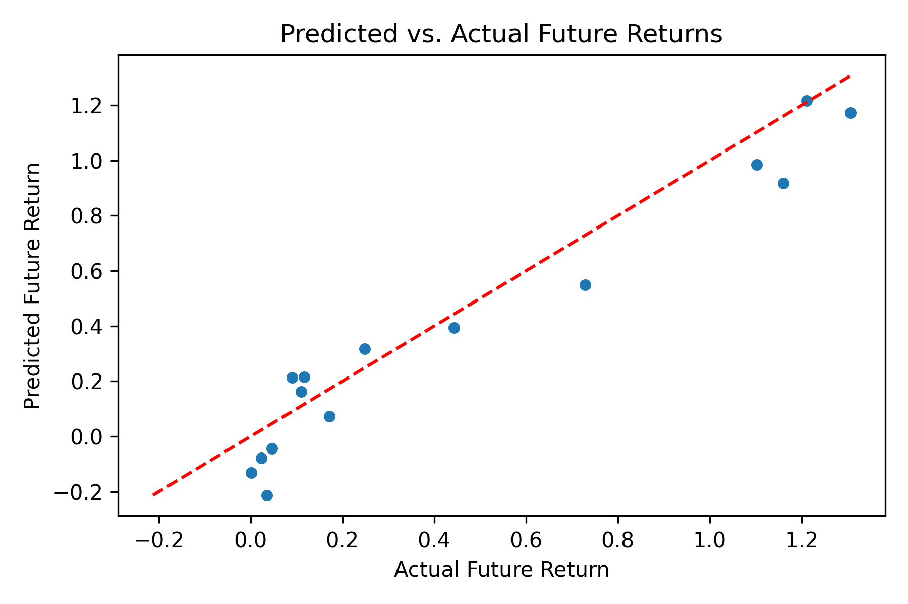
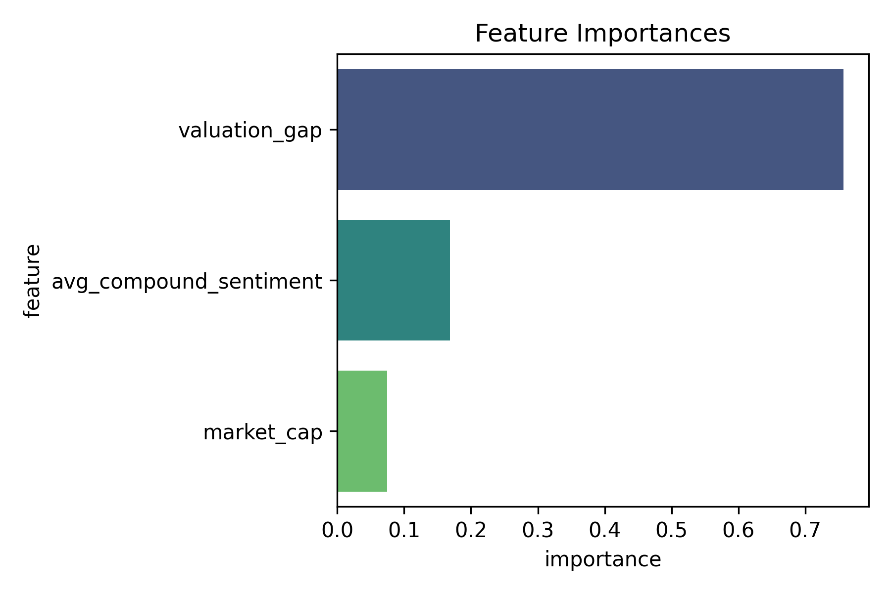
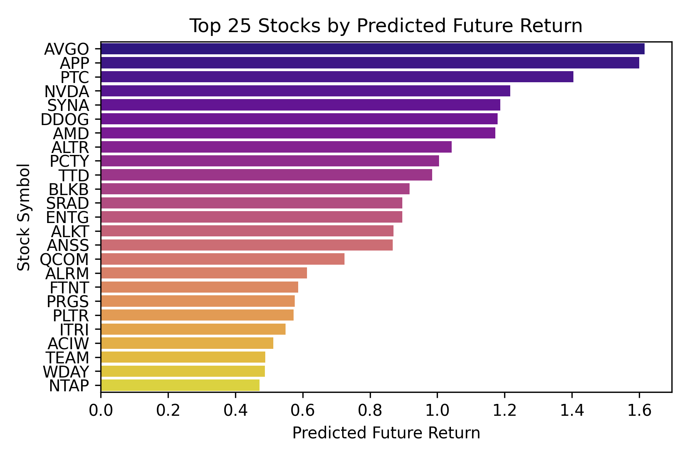

# stock_picker: CS210 Project

Predicting Top n Tech Stocks To Buy

Matthew Vandenberg (msv77), Jeet Gupta (jdg231), Jericho Mascarinas (jjm606)

**Graders: Feel free to jump to [Running the Project Locally](#running-the-project-locally)!**

# Our Development Process

## Our Python Environment

### Create Python Virtual Environment

In this project, we utilized Python virtual enviroments to keep pip packages consistent across all machines, while avoiding externally managed environment errors.

To create it, we use:

```shell
bash create_venv.sh
```

which implicitly runs:

```shell
python -m venv venv
source venv/bin/activate
pip install -r requirements.txt
```

If we want to update the requirements.txt file with the packages that we've installed with pip thus far, we can run:

```shell
pip freeze > requirements.txt
```

and then if we need to update the requirements again later:

```shell
pip install -r requirements.txt
```

### Storing API calls

For our database, we chose sqlite as the entire database can be stored in a single file, making it the perfect solution for keeping in version control like Git.

1. First, we made sure that `sql-lite` exists on our system by typing:

```shell
sqlite3 --version
```

2. Next, we create our database file with

```shell
mkdir db
source .env
sqlite3 $DB_PATH
```

_This launches the sqlite shell, where the file `db/database.sqlite` will constantly be updated based on the actions we perform in the database._

3. We first created the `api_responses` table with:

```sql
CREATE TABLE api_responses (
    id INTEGER PRIMARY KEY,
    timestamp DATETIME DEFAULT CURRENT_TIMESTAMP,
    response_json TEXT
);
```

4. We then tested that this table was created successfully by inserting a test record:

```sql
sqlite> INSERT INTO api_responses (response_json) VALUES ('{"example": "data"}');
```

5. We can confirm that the data works by selecting from it:

```sql
sqlite> SELECT * FROM api_responses;
1|2024-12-08 21:45:05|{"example": "data"}
```

6. We then delete the test record and exit the sqlite shell by typing:

```sql
DELETE FROM api_responses;
.exit
```

### Accessing the Database from Python

Check out `test_sqlite_connection.py` to see how we tested the connection to the database file and made sure the data stayed consistent. You can run the test locally with

```shell
pip install python-dotenv
python3 test_sqlite_connection.py
```

## Locating Stocks in the Technology Sector

One of the most difficult parts of this project was trying to locate an online resource that would provide a list of stocks that exist in the technology sector, as that is what we are targetting. Doing some research, we were able to locate [this StockAnalysis website](https://stockanalysis.com/list/nasdaq-stocks/), which listed every stock and allowed a column for sector. There was no _last updated_ anywhere, but based on stock prices we realized that the data isn't more than a day old. As this step in the process was only to accumulate NASDAQ stocks in the technology sector anyways, it was good enough for that so we went with it.

After inspecting the data in the Chrome developer tools, we saw that the site sends http get requests to **api.stockanalysis.com**. Surely we thought there was some client authentication involved as most of their filters are locked behind a paywall. After doing some testing in Postman, we realized that this API was completely open and not rate-limited in any way, and we could even ask the API for columns locked behind the web interface's paywall!

So, we created `tech_stock_list_dl.py`, which let us download all the stocks listed on that website in JSON format. In a nutshell, it:

1. Confirms that our database file exists, then makes the API call
2. Removes any duplicates. There weren't any, but we felt it was necessary given we were exploiting their open API, which sometimes uses pagination depending on the normal of columns we requested
3. Prints out how many stocks it fetched
4. Uses the **Sector** key to filter out stocks in the Technology sector, then prints out how many tech stocks it found
5. Creates a table in our database called **tech_stocks**, with some of the data that we have in this call, while also adding more columns that we planned on filling in later from a more accurate stock source
6. Inserts each tech stock into the table
7. Printed out the count afterwards executed on the table to ensure that all the records were accounted for and inserted successfully

In all, we fetched **3319** stocks, where **559** of them ended up being technology stocks:

```shell
(venv) user@computer stock_picker % python3 tech_stock_list_dl.py
```

```
Raw API data saved to stock_list_dl.json
Total stocks fetched: 3319
Found 559 technology stocks
Unique technology stocks after deduplication: 559
Data inserted: 559 stocks successfully into tech_stocks table.
Number of records in the database: 559
```

## Stock Evaluation

After running `tech_stock_list_dl.py` the database is now populated with tickers of all technology stocks within the NASDAQ. `stock_evaluation.py` is where we now analyze and pull the main bulk of information about the stocks. To start, we look at our target tickers which are companies that are considered mid and large cap.

This is done with a quick query:

```sql
SELECT symbol FROM tech_stocks WHERE market_cap >= 2000000000
```

Now that we have the specific stocks above a particular market cap we can start grabbing current information about them using the yahoo finance API. Some of the information that we got includes attributes like current price, projected EPS, forward PE ratio, beta value, earnings growth, and many more.

Here is an example of an yfinance API call for a particular ticker,

```python
stock = yf.Ticker(ticker)
earnings_growth = (stock.info.get("earningsGrowth", None) or 0.0)
beta = stock.info.get("beta", 1.0)
curr_price = stock.info.get("currentPrice", 0.0)
```

After pulling the data that we needed on each stock from each API call, we were able to now move on to the more finance related analysis and more specifically, evaluating the stock.

Now after extensive research, we came across a formula for calculating the intrinsic value and fair value of a stock. The difference between the two is that fair value looks more at market based factors and how much investors are willings to pay based on expected future earnings. Intrinsic value, however, looks at company's fundamental, long-term value. This includes things like future growth assumptions, risk adjustments which is basically meant to capture the "true" or "real" value. Now I included fair value within the table for you to view but its really just a metric to compare to the instrinsic value to make sure it was calculated correctly.

The formula we used for intrinsic value was:

```python
discount_rate = risk_free_rate + (beta * (market_return - risk_free_rate))
intrinsic_value = projected_eps * stock_pe_ratio_forward * (1 + earnings_growth) * (1 - discount_rate)
```

We are using a lot of forecasted data (projected EPS or stock forward PE ratio) rather than current historical data (current EPS or stock trailing PE ratio) because, in equity analysis, that is typically how stock evaluation and buy predictions are done (usually utilizing future cash flows and other metrics). To calculate the discount rate we are using average market return of 8% and risk free rate of 3% which is typically based on the yield of a long term US Treasury bond.

Finally, to assign a weighted value to a particular stock which we will use as the main metric for ranking, we utilize percentage difference between the instrinsic value and the price the particular stock is currently trading at.

Here is what the formula looks like:

```python
valuation_gap = ((curr_price - intrinsic_value) / intrinsic_value) * 100
```

If valuation gap > 0 then the we know the stock is trading too high compared to its instrinsic value that we calculated (overvalued). If it is negative, then it is undervalued. The more negative the valuation is determines what the potential best buys to make currently are which `final_model.py` goes on to further analyze.

Before fitting this finalized information into the database table, we need to account for outliers, missing and skewed data. We did this by pushing all the information obtained from the API into a dataframe and going through a list of cleaning steps:

1. Remove rows with negative or zero EPS values
2. Remove rows where PE ratios are negative or zero
3. Verify that earnings growth is equal to or above 0
4. Used Z-Score for outliers to sure that instrinsic ratio (instrinisic value / current price) of a stock is in between 2 standard deviations of the mean
5. Removed rows that are missing or zero for current price, instrinsic value, and fair value

Once the dataframe is cleaned. We inputted all the filtered information into the database table.

## Ticker Relevance in the Media

### Finding the Articles

Surely we can create models and analyze stock data to figure out the top technology stocks in a given moment. However, we realize the need for supplementing this data with actual news source data, as knowing how people discuss/report on a stock is also important to take into consideration. So, we decided to look for an API that would give us news articles for each ticker, allowing us to count how many there are, and scrape the new articles in order to locate keywords in each article.

We found an API called Finnhub. Conveniently, they also provide a Pip package to interact with their API. So we created the script `find_articles.py`, which does the following:

1. Connects to our database
2. Creates the following table if it doesn't already exist:

```sql
CREATE TABLE IF NOT EXISTS news (
    id INTEGER PRIMARY KEY AUTOINCREMENT, -- Helps us uniquely identify each news article later
    ticker TEXT NOT NULL, -- NOT NULL anything that is crucial
    category TEXT,
    datetime TEXT NOT NULL,
    headline TEXT NOT NULL,
    image TEXT,
    related TEXT,
    source TEXT NOT NULL,
    summary TEXT,
    url TEXT NOT NULL,
    created_at TIMESTAMP DEFAULT CURRENT_TIMESTAMP, -- Help us know when the script pulled in the article
    FOREIGN KEY (ticker) REFERENCES tech_stocks(symbol), -- Keeps tickers consistent to help aggregate data later
    UNIQUE (ticker, datetime, headline, source) -- Keeps entries unique, so that all articles are unique and there are no duplicates
);
```

3. With each provided ticker, queries the Finnhub API, retrieving all articles for each `ticker` written between `from_date` and `to_date`

4. Displays how many articles were found, how many new articles were found, and how many duplicates were skipped

When ran for the first time with tickers `["AAPL", "GOOGL", "AMZN", "MSFT", "TSLA"]`, for example, the table doesn't exist, nor do any articles for these tickers exist so all articles will be added to the table:

```shell
(venv) user@computer stock_picker % python3 find_articles.py
AAPL:   Found 174 articles, inserted 174 new articles, skipped 0 duplicate articles.
GOOGL:  Found 178 articles, inserted 178 new articles, skipped 0 duplicate articles.
AMZN:   Found 220 articles, inserted 220 new articles, skipped 0 duplicate articles.
MSFT:   Found 199 articles, inserted 199 new articles, skipped 0 duplicate articles.
TSLA:   Found 212 articles, inserted 212 new articles, skipped 0 duplicate articles.
```

However, if we adjust the dates slightly to overlap some of the last date range, and adjust the tickers, some results will be skipped.

If we exchange 3 tickers:

```shell
(venv) user@computer stock_picker % python3 find_articles.py
AAPL:   Found 174 articles, inserted 0 new articles, skipped 174 duplicate articles.
TSLA:   Found 212 articles, inserted 0 new articles, skipped 212 duplicate articles.
ADP:    Found 12 articles, inserted 12 new articles, skipped 0 duplicate articles.
LYFT:   Found 12 articles, inserted 12 new articles, skipped 0 duplicate articles.
OKTA:   Found 39 articles, inserted 39 new articles, skipped 0 duplicate articles.
```

If we add 3 more days of history, totalling 10:

```shell
(venv) user@computer stock_picker % python3 find_articles.py
AAPL:   Found 215 articles, inserted 41 new articles, skipped 174 duplicate articles.
TSLA:   Found 239 articles, inserted 27 new articles, skipped 212 duplicate articles.
ADP:    Found 17 articles, inserted 5 new articles, skipped 12 duplicate articles.
LYFT:   Found 14 articles, inserted 2 new articles, skipped 12 duplicate articles.
OKTA:   Found 45 articles, inserted 6 new articles, skipped 39 duplicate articles.
```

### Sentiment Analysis

To programmatically analyze each article, we needed a way where we could calculate the postive, negative, and neutral sentiments. Here's how we did that:

```shell
(venv) example@computer stock_picker % cd sentiment_scraper
# Example Run (We don't care about seeing the response of every article, so we append --nolog here)
(venv) example@computer sentiment_scraper % scrapy crawl db_spider --nolog
../db/database.sqlite
Processing article 32/3108 (1.0296010296010296%)...
```

#### 1. Scraping Each Article

We already had each article for every stock that we wanted to discover the sentiments of, so we utilized Scrapy to visit every website and pull the HTML code from the website source.

#### 2. Parsing the Article Contents

After each response came back, if it returned a `200 OK` status code, we took the content of the site and used the Python newspaper library to automatically retrieve the text content of the actual body of the article. We do this so that we avoid "sentimizing" words that aren't a part of the article itself, such as log in buttons, advertisements, cookies, etc.

Notice how we specifically mention the response having a `200` status code. Ultimately, web scraping means that the computer is visiting the website on your behalf, as opposed to you the user physically visiting the website. Some sites don't like when this happens, potentially because of analytical or advertisement reasons, so it is possible that the scraper faced several bot challenges and was not able to load the website successfully. We saw a decent handful of `400 Bad Request`, `401 Unauthorized`, and `403 Forbidden` statuses, and in our runs, we noticed about half of the articles faced this issue:

```sql
-- News articles that returned a 200 OK status code (had a matching sentiment added)
sqlite> SELECT COUNT(*) FROM news AS N LEFT JOIN sentiments AS S ON N.id = S.article_id WHERE S.article_id != "";
1535

-- Total amount of news articles
sqlite> SELECT COUNT(*) FROM news;
3108
```

#### 3. Performing Sentiment Analysis on the Text

After we retrieved only the body of the article, we decided to run it through a Sentiment Analyzer from nltk (`from nltk.sentiment.vader import SentimentIntensityAnalyzer`). This would take our blob of text, run an algorithm to decide the amount of positive, negative and neutral words come out of it, and rate it with corresponding numbers. If our compound score came out to at least `0.05`, we determined it as an overall positive article. If less, negative, and if exactly `0.05`, neutral. This gave us great weights as to how we can classify the article as a whole so that we can make a final determination about that ticker in the future.

#### 4. Inserting the Results into the Database

Scraping is quite computationally expensive, so we only wanted to do it once. Because of this, we decided to store each of the sentiment results in this table:

```sql
CREATE TABLE IF NOT EXISTS sentiments (
    id INTEGER PRIMARY KEY AUTOINCREMENT,
    article_id INTEGER,
    url TEXT,
    score_neg REAL,
    score_neu REAL,
    score_pos REAL,
    score_compound REAL,
    overall_sentiment TEXT,
    FOREIGN KEY (article_id) REFERENCES news(id), -- References the news table for easier joins later!
    UNIQUE (article_id)
)
```

Together, with this data now in our database, we could make predictions on the best stocks to buy based on how the tickers were discussed in the media.

## Making the Final Decision

To finalize our predictions for the top stocks to buy, we combined quantitative financial data with sentiment analysis. Below is an overview of the process we followed and the insights we derived, ran inside `final_model.py`.

### Feature Engineering

We engineered the following features for the model:

- **Valuation Gap**: Difference between intrinsic value and current price. This metric identifies stocks that may be undervalued or overvalued relative to their intrinsic worth.
- **Average Compound Sentiment**: Mean sentiment score for each ticker, aggregated from news articles. This reflects the overall public and media sentiment around a stock, which can influence its market performance.
- **Market Cap**: Company size to ensure we focused on medium or large market cap stocks, as these are more stable and widely traded.

Additionally, we calculated a target variable:

- **Future Return**: `(Future Price - Current Price) / Current Price`. This allowed us to estimate the potential percentage gain or loss for each stock.

### Exploratory Data Analysis

To understand the relationships between features and the target variable, we performed the following analyses and visualizations:

1. **Distribution of Valuation Gap**:
   - This histogram highlighted the range and frequency of valuation gaps across stocks, showing clusters of undervalued and overvalued stocks.
   - Outliers in this distribution may represent stocks with unusual valuation metrics due to specific events, such as recent mergers, acquisitions, or financial misreporting.
   - Sample `./sample_plots/valuation_gap_distribution.png`:

<p align="center">
  
</p>

2. **Distribution of Average Compound Sentiment**:
   - Visualized the sentiment polarity of articles, showing whether stocks were discussed positively or negatively overall.
   - Outliers in sentiment could arise from significant news events, such as scandals or breakthroughs, that drastically affect public perception.
   - Sample `./sample_plots/compound_sentiment_distribution.png`:

<p align="center">
  
</p>

3. **Scatterplot: Valuation Gap vs. Future Return**:
   - Revealed a positive correlation, suggesting that higher valuation gaps tend to predict higher future returns.
   - Outliers in this scatterplot might represent stocks with unusually high or low future returns driven by exceptional circumstances, such as market corrections or unexpected company performance.
   - Sample `./sample_plots/valuation_vs_future.png`:

<p align="center">
  
</p>

4. **Scatterplot: Sentiment vs. Future Return**:
   - Showed how sentiment impacts future return, with stocks discussed positively in the media often having higher predicted returns.
   - Outliers could be due to market overreaction or underreaction to news articles, where sentiment scores don’t align with actual stock performance.
   - Sample `./sample_plots/sentiment_vs_future_return.png`:

<p align="center">
  
</p>

5. **Correlation Matrix**:
   - Demonstrated relationships among features and the target, confirming their relevance for modeling.
   - The correlation matrix highlighted that while valuation gap and sentiment had strong individual correlations with future returns, market cap had a moderate impact, which aligns with our hypothesis about its stabilizing effect.
   - Sample `./sample_plots/correlation_matrix.png`:

<p align="center">
  
</p>

### Modeling Approach

We trained a **Random Forest Regressor** using the `valuation_gap`, `avg_compound_sentiment`, and `market_cap` features to predict `future_return`. The steps included:

1. **Train-Test Split**:

   - Split the data into training (80%) and testing (20%) sets to ensure the model generalizes well to unseen data.

2. **Model Training**:

   - Used 100 trees in the Random Forest for robust predictions, taking advantage of its ability to handle nonlinear relationships and feature interactions.

3. **Model Evaluation**:

   - Achieved an R-squared score of **0.9244** on the test set, indicating a strong model fit and reliable predictive performance.

4. **Visualizations**:
   - **Predicted vs. Actual Future Returns**: Plotted predicted values against actuals to evaluate the model's accuracy. Outliers in this plot may represent stocks with unique external factors not captured by our features.
   - Sample `./sample_plots/predicted_vs_actual_future_returns.png`:

<p align="center">
  
</p>

- **Feature Importances**: Highlighted that `valuation_gap` and `avg_compound_sentiment` were the most predictive features. This aligns with our expectation that undervaluation and public sentiment significantly influence stock performance.
- Sample `./sample_plots/feature_importances.png`:

<p align="center">
  
</p>

### Insights

The Random Forest model confirmed:

- **Valuation Gap** is a key driver of future returns, as expected from its direct relationship with stock undervaluation or overvaluation.
- Positive **Media Sentiment** is strongly associated with higher returns, reinforcing the importance of public perception in market dynamics.
- Combining financial data and sentiment analysis provides a more holistic prediction model, addressing both quantitative and qualitative factors.

### Stock Recommendations

Using our trained model, we predicted future returns for the latest stock data and selected the top 25 best performing technology stocks. Results included:

- **Top 25 Stocks by Predicted Future Return**:
  - Visualized as a horizontal bar chart for clarity.
  - Outliers in the top-performing stocks may be driven by short-term catalysts, such as earnings reports or sector trends.
  - Sample `./sample_plots/top_25_stocks_prediction.png`:

<p align="center">
  
</p>

These recommendations are dynamic and can be updated as new data becomes available.

## Conclusion

By integrating financial metrics with sentiment analysis, we developed a robust pipeline to identify top technology stocks. Our approach ensures that both market fundamentals and public sentiment are considered, leading to data-driven, actionable insights. While the model performs well, future iterations could benefit from additional features, such as sector-specific trends or global economic indicators, to further improve its predictive accuracy.

# Running the Project Locally

This guide will demonstrate how to run the project for yourself! Follow these steps:

1. Create an API Key for Finnhub.io, you can do that by clicking [here](https://finnhub.io/).

2. In the root of the `stock_picker` repository, create a `.env` file with the following properties:

```shell
FINNHUB_API_KEY="your-finnhub-api-key"
DB_PATH="path-to-db-file"
PLOT_OUTPUT_PATH="path-to-plots"
```

Explanation:

- `FINNHUB_API_KEY="your-finnhub-api-key"`: Identifies your account with the API calls you will make to Finnhub.io, for pulling news articles for various tickers.

- `DB_PATH="path-to-db-file"`: Path to the sqlite3 database file. This can be whatever you want, but we used `db/database.sqlite`. **Create an empty file here with read and write permissions in this directory**.

- `PLOT_OUTPUT_PATH="path-to-plots"`: The directory you want to store the final prediction result graphs from matplotlib. Again, this can be whatever you want, but we used `./plots/`. **The directory will be created if it doesn't already exist.**

3. Create a Python virtual environment, and install our dependencies. You can do this with:

```shell
python3 -m venv venv
source venv/bin/activate
```

Make sure that your Terminal prompt is now preceeded with `(venv)`, like this:

```shell
(venv) user@computer stock_picker %
```

Then finally run:

```shell
pip install -r requirements.txt
```

to install the dependencies into the virtual environment.

When you open any of our Python files, you may see an underline saying that the module isn't found. You'll need to change your VSCode's Python environment (if you are running from a terminal, you can skip this part):

- Use <kbd>⌘</kbd> + <kbd>Shift</kbd> + <kbd>P</kbd> on MacOS or <kbd>Ctrl</kbd> + <kbd>Shift</kbd> + <kbd>P</kbd> on other systems to open the VSCode Command Palette.
- Search for **Python: Select Interpreter**
- Select **Use Python from 'python.defaultinterpreterPath' setting./venv/bin/python**
- _(This part isn't necessarily important if you don't plan on inspecting methods inside the python files)_

4. Test the connection to your database file by running `python3 test_sqlite_connection.py`:

```shell
(venv) user@computer stock_picker % python3 test_sqlite_connection.py
Test complete
```

5. Download the list of tech stocks and import into the database by running `python3 tech_stock_list_dl.py`:

```shell
(venv) user@computer stock_picker % python3 tech_stock_list_dl.py
Total stocks fetched: 3317
Found 559 technology stocks
Unique technology stocks after deduplication: 559
Data inserted: 559 stocks successfully into tech_stocks table.
Number of records in the database: 559
```

_Your numbers may slightly vary, but should be very close to these numbers._

6. Calculate financial data and make prediction with valuation data by running `python3 stock_valuation.py`:

```shell
(venv) user@computer stock_picker % python3 stock_valuation.py
Found 192 tech stocks with market cap greater than or equal to 2000000000
Processing ARM (10/192)
...
Filtered down to 151 stocks after data cleaning.

```

_See our writeup for why we chose a $2B market cap._

7. Find all articles on these tickers and perform sentiment analysis by running `python3 find_articles.py`:

```shell
(venv) user@computer stock_picker % python3 find_articles.py
Found 74 tech stocks in the database.
AAPL (#1):      Found 231 articles, inserted 38 new articles, skipped 0 duplicate articles.
NVDA (#2):      Found 237 articles, inserted 11 new articles, skipped 0 duplicate articles.
....
```

_As the Finnhub.io API has a rate limit of 60 requests per minute, this may take a few minutes to run!_

8. Next, let's scrape the articles we found and perform sentiment analysis:

```shell
(venv) user@computer sentiment_scraper % cd sentiment_scraper
(venv) user@computer sentiment_scraper % scrapy crawl db_spider --nolog
../db/database.sqlite
Processing article 1296/1765 (73.42776203966007%)
...
```

_See our writeup for why we chose a $2B market cap._

8. Finally, train the model based on financial and sentiment data and predict the top tech stocks to buy right now by running `python3 final_model.py`:

```shell
(venv) user@computer stock_picker % cd ..
(venv) user@computer stock_picker % python3 final_model.py
Training the model and plotting the results to ./plots/...
R-squared on test set: -0.2520
Model trained and results plotted successfully.
Enter the number of top stocks to pick: 25

***************************************************************
Top 25 stocks to buy now, based on stock and media data:
***************************************************************

   symbol  predicted_return
1    AVGO          1.615793
2     APP          1.600393
3     PTC          1.404382
4    NVDA          1.216667
5    SYNA          1.186900
6    DDOG          1.179221
7     AMD          1.172646
8    ALTR          1.042899
9    PCTY          1.004876
10    TTD          0.984205
11   BLKB          0.917687
12   SRAD          0.896526
13   ENTG          0.895907
14   ALKT          0.869918
15   ANSS          0.867849
16   QCOM          0.724012
17   ALRM          0.612942
18   FTNT          0.586781
19   PRGS          0.576283
20   PLTR          0.572944
21   ITRI          0.549364
22   ACIW          0.513027
23   TEAM          0.489249
24   WDAY          0.488055
25   NTAP          0.471363
```

You'll see the final graphs outputted to the directory you chose!
